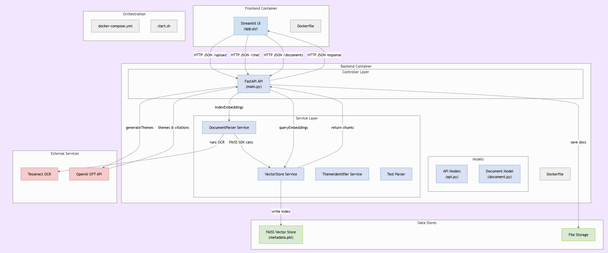

# Document Theme Identifier Chatbot

A sophisticated chatbot that performs research across multiple documents, identifies common themes, and provides detailed, cited responses to user queries.

## Features

- Upload and process 75+ documents (PDF, DOCX, scanned images)
- OCR support for scanned documents
- Natural language query processing
- Theme identification across documents
- Detailed citations and source tracking
- Modern web interface

## Architecture

- Backend: FastAPI with Python
- Frontend: Streamlit
- Database: Vector store (FAISS)
- OCR: Tesseract
- LLM: OpenAI GPT

## Getting Started

### Prerequisites

- Docker and Docker Compose
- OpenAI API Key

### Installation

1. Clone the repository:
```bash
git clone https://github.com/yourusername/simran-r-wasserstoff-AiInternTask.git
cd simran-r-wasserstoff-AiInternTask
```

2. Set up environment variables:
```bash
echo "OPENAI_API_KEY=your_api_key_here" > .env
```

3. Start the application:
```bash
docker-compose up --build
```

The application will be available at:
- Frontend: http://localhost:8501
- Backend API: http://localhost:8000

## Usage

1. Open the web interface at http://localhost:8501
2. Enter your OpenAI API key in the sidebar
3. Upload documents in the "Upload Documents" tab
4. Switch to "Chat & Analysis" tab to query your documents
5. View identified themes and document citations

## API Documentation

The backend API provides the following endpoints:

- `POST /upload`: Upload a document
- `POST /chat`: Process a query and get themes
- `GET /documents`: List all uploaded documents

For detailed API documentation, visit http://localhost:8000/docs

## Development

To set up the development environment:

1. Create a virtual environment:
```bash
python -m venv venv
source venv/bin/activate  # Linux/Mac
```

2. Install dependencies:
```bash
pip install -e .
```

3. Run the backend:
```bash
cd backend
uvicorn app.main:app --reload
```

4. Run the frontend:
```bash
cd frontend
streamlit run app.py
```

## WORKFLOW




## FOLDER Structure

```text
├── LICENSE
├── README.md
├── backend
│   ├── Dockerfile
│   ├── __init__.py
│   ├── app
│   │   ├── __init__.py
│   │   ├── api
│   │   ├── config.py
│   │   ├── core
│   │   ├── main.py
│   │   ├── models
│   │   │   ├── api.py
│   │   │   └── document.py
│   │   └── services
│   │       ├── __init__.py
│   │       ├── document_parser.py
│   │       ├── test_parser.py
│   │       ├── theme_identifier.py
│   │       └── vector_store.py
│   ├── data
│   │   └── vectorstore
│   │       ├── faiss.index
│   │       └── metadata.pkl
│   └── files
│       ├── DOC02.docx
│       └── doc2.jpg
├── commands
├── demo
├── docker-compose.yml
├── docs
├── frontend
│   ├── Dockerfile
│   ├── app.py
│   ├── requirements.txt
│   └── temp
├── requirements.txt
├── setup.py
├── start.sh
├── tests
└── theme_identifier_chatbot.egg-info
    ├── PKG-INFO
    ├── SOURCES.txt
    ├── dependency_links.txt
    ├── requires.txt
    └── top_level.txt
```


## 🟢 Demo


[![***Click image for Demo video***]](https://drive.google.com/file/d/1JcnzapD0pwp1se2Wh2gXAwReLC08XBBL/view?usp=drive_link)

[](https://drive.google.com/file/d/1JcnzapD0pwp1se2Wh2gXAwReLC08XBBL/view?usp=drive_link)


## License

This project is licensed under the MIT License - see the [LICENSE](LICENSE) file for details.